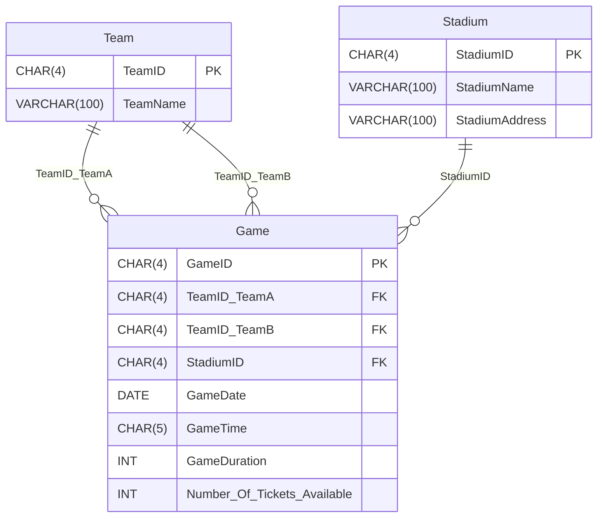

# Game SQL Project

## Table of Contents
- [Project Overview](#project-overview)  
- [Technology Stack](#technology-stack)  
- [Project Structure](#project-structure)  
- [Installation and Setup](#installation-and-setup)  
- [Features](#features)  
- [Database Schema](#database-schema)  
- [Entity Relationship Diagram (ERD)](#entity-relationship-diagram-erd)  
- [Queries Implemented](#queries-implemented)  
- [Running the Solution](#running-the-solution)  
- [Disclaimer](#disclaimer)  

## Project Overview
This project implements a relational database for managing teams, stadiums, and games.  
The solution demonstrates **DDL (Data Definition Language)**, **DML (Data Manipulation Language)**, 
and **DQL (Data Query Language)** skills by creating tables, enforcing constraints, inserting realistic data, and writing queries for analytics.

## Technology Stack
- **Database**: Microsoft SQL Server (T-SQL)  
- **Tool**: SQL Server Management Studio (SSMS) or equivalent SQL client  

## Project Structure

```
game-sql/
├── solutions.sql   # Complete SQL script (schema, inserts, queries)
└── README.md       # Project documentation
````

## Installation and Setup
1. Clone the repository:
```bash
   git clone https://github.com/HChristopherNaoyuki/game-sql.git
```

2. Open `solutions.sql` in SQL Server Management Studio or another SQL client.
3. Execute the script in order:

   * Database and tables creation
   * Insert statements
   * Alter table commands
   * Queries

## Features

* Database `GAMES` with three main entities: **Team**, **Stadium**, **Game**
* Enforced **primary keys**, **foreign keys**, and integrity constraints
* Seed data for 5 teams, 5 stadiums, and multiple games
* Alteration of tables to add new fields (e.g., tickets available)
* Update queries to manage game ticket allocations
* Queries to analyze stadium usage and find longest game durations

## Database Schema

**Entities:**

* **Team**: Stores team information (TeamID, TeamName)
* **Stadium**: Stores stadium details (StadiumID, StadiumName, StadiumAddress)
* **Game**: Records scheduled games, linking teams and stadiums with date, time, and duration

**Relationships:**

* One-to-many: Stadium → Games
* Many-to-many: Teams ↔ Games (via TeamID_TeamA and TeamID_TeamB)

## Entity Relationship Diagram (ERD)



## Queries Implemented

* **Q.1.4** Update number of tickets available for a specific game
* **Q.2.1** List stadiums with no scheduled games
* **Q.2.2** Retrieve the longest game duration scheduled at a specific stadium

## Running the Solution

* Execute `solutions.sql` in your SQL environment
* Verify created objects using `SELECT` queries
* Run analytical queries to validate results

## Disclaimer

This project is for **educational purposes** only.
It demonstrates intermediate SQL concepts such as schema design, constraints, DML, and query optimization.
It is not intended for production deployment.

---
